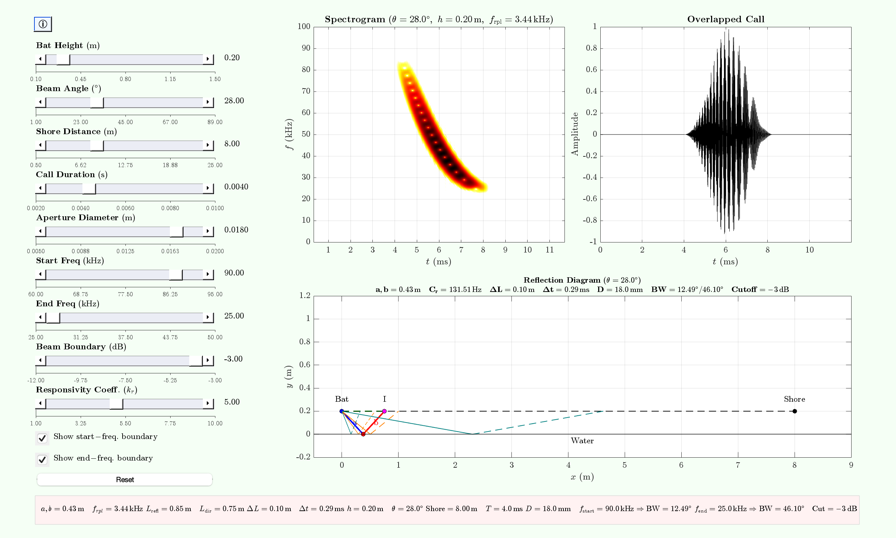

# Ripple Studio (v1.2)

Interactive MATLAB app for exploring **spectral interference (“ripples”)** in bat echolocation over water surfaces.

RippleStudio simulates a down-swept FM bat call emitted above a water surface. The **direct path** and its **water-reflected copy** interfere, producing characteristic **spectral ripple patterns** (frequency-domain AM signatures). The GUI links geometry, call parameters, and beam assumptions to three live visualisations:

- **Spectrogram** of the overlapped (direct + delayed) call  
- **Waveform** of the overlapped call  
- **Plan-view geometry** with optional beam boundary lines

<div style="text-align: center;">
  
</div>


---

## Quick start

In MATLAB:

```matlab
h = RippleStudio;   % launch GUI
```

### Export figures “as seen”
You can export any axes exactly as displayed:

```matlab
h.exportAxestoPDF(h.ax1,  'spectrogram.pdf');   % spectrogram
h.exportAxestoPDF(h.ax1b, 'waveform.pdf');      % waveform
h.exportAxestoPDF(h.ax2,  'diagram.pdf');       % geometry
```

> Note: In the provided class file, `exportAxestoPDF` is documented but may be commented out, while `exportAxesExact` is implemented.  
> If `exportAxestoPDF` is unavailable, use the following, which exports the labels and axes cleanly.
```matlab
h.exportAxesExact(h.ax1,  'spectrogram.pdf');
h.exportAxesExact(h.ax1b, 'waveform.pdf');
h.exportAxesExact(h.ax2,  'diagram.pdf');
```

---

## Programmatic outputs

After launch (or after interacting with sliders), you can access the generated signals:

```matlab
x      = h.call;            % direct FM call (column)
x_ref  = h.indirectCall;    % delayed/reflected copy
x_sum  = h.overlapCall;     % 0.5*(x + x_ref)
t_ms   = h.t_ms;            % time vector (ms)
dt_s   = h.dt_s;            % geometric delay τ (s)
```

---

## Background Colours

Change the RGB value at `line number 144` via the argument `Color` to customise the background colour to your liking.

## Controls

### Sliders (left column)

- **Bat Height (m)** – emitter altitude above water  
- **Beam Angle (°)** – downward angle of sonar axis  
- **Shore Distance (m)** – horizontal offset to shoreline  
- **Call Duration (s)** – FM sweep length  
- **Aperture Diameter (m)** – piston source size (beamwidth model)  
- **Start Freq (kHz)** – FM sweep start (high) frequency  
- **End Freq (kHz)** – FM sweep end (low) frequency  
- **Beam Boundary (dB)** – cutoff for beam edges (e.g. −3 dB)  
- **Responsivity Coeff. ($k_r$)** – used to compute an effective call rate in the diagram panel  

### Checkboxes

- **Show start-freq. boundary** – beam edges at start frequency  
- **Show end-freq. boundary** – beam edges at end frequency  

### Buttons / menu

- **Reset** – restore all sliders to defaults  
- **ⓘ / Help** (or Help menu) – opens a scrollable documentation window  
  - The help window attempts to read `documentation.txt` (optional)

---

## Visual outputs

### Spectrogram (top-left)
Displays the overlapped call. Title reports θ, h, and ripple spacing f_rpl, where:

- τ = (L_reflected − L_direct)/c  
- f_rpl = 1/τ (Hz)  
- Temporal beat frequency: f_AM = 1/(2τ) (Hz)

**Interpretation:** Null-to-null spectral spacing equals f_rpl.

### Waveform (top-right)
Time-domain overlapped signal.

### Geometry (bottom)
Plan-view diagram of the direct and reflected paths, the interference point, and optional beam edges at the selected cutoff.

---

## Model summary

- **Call:** Down-swept FM (quadratic), Hann-tapered, optional padding  
- **Beamwidth:** Circular piston model; edges defined at chosen dB cutoff  
- **Interference:** Overlap of direct and delayed copies (mean)  
- **Spectrogram:** |STFT| in dB, fixed dynamic range  

### Mathematical reference

- Speed of sound: c = 343 m/s  
- Delay: τ = (L_reflected − L_direct)/c  
- Ripple spacing: f_rpl = 1/τ  
- Temporal beat: f_AM = 1/(2τ)

---

## Files & requirements

- **MATLAB R2018b+** (R2021a+ recommended for `exportgraphics`)  
- Optional: `documentation.txt` (populates the Help panel if present)

Default constants:
- Sampling rate: `fs = 192e3`
- Sound speed: `c = 343`

---

## Citation

If you use RippleStudio in publications or teaching, please cite:

---

## License

CC-BY-NC 4.0 (see `LICENSE`).

