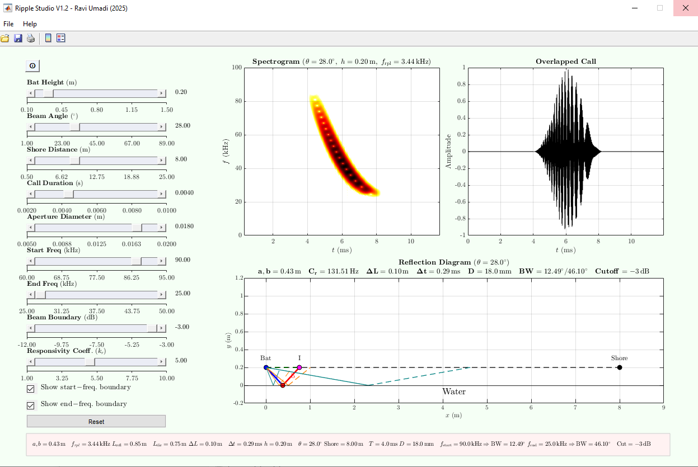

# Installation

The standalone packages require MATLAB Runtime, which is automatically installed. Complete the installation process as you would for any regular application. 

MATLAB Runtime download may take time and requires a stable internet connection. Ensure connectivity. 

## Installed Versions

The functionality and appearance of the app on macOS and Windows are essentially the same. 

### Windowsx64 (Win10/11)  

---

### macOS (Sequoia 15.6.1)

